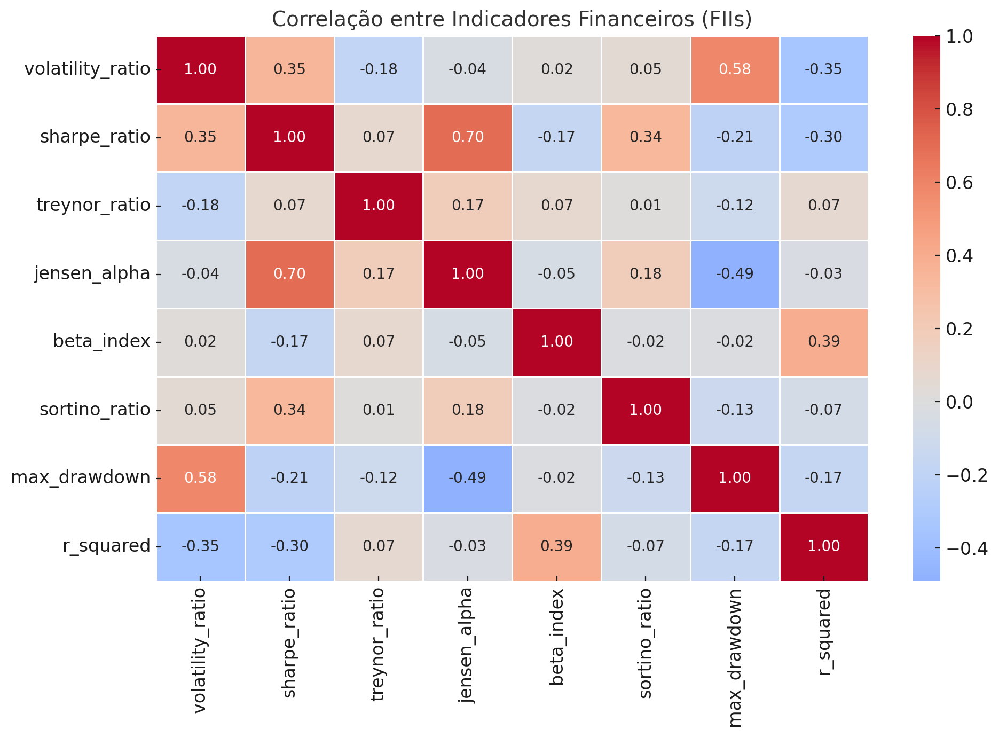
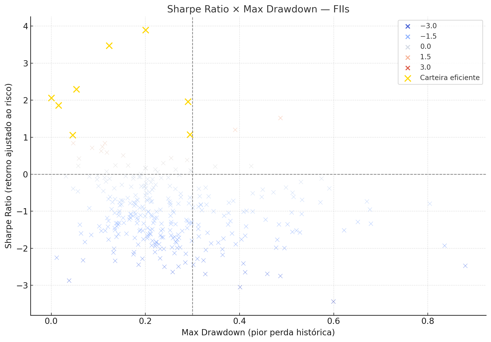
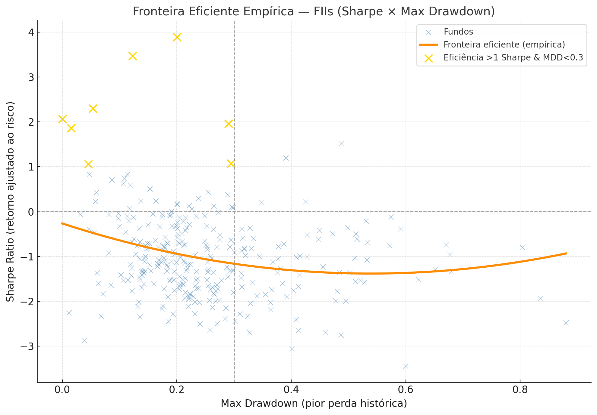
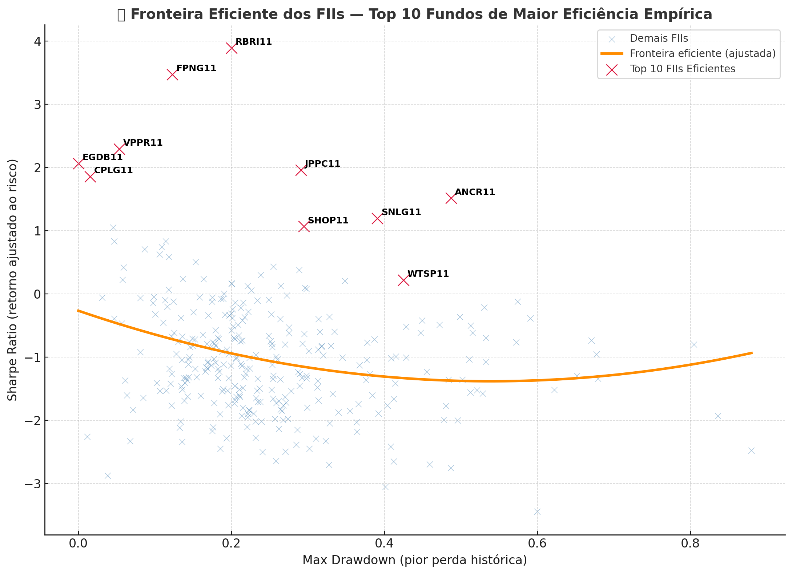

## 📊 Estrutura geral

| Aspecto             | Valor                                                                                                                             |
| ------------------- | --------------------------------------------------------------------------------------------------------------------------------- |
| Linhas (FIIs)       | **415**                                                                                                                           |
| Colunas de métricas | 8 indicadores quantitativos                                                                                                       |
| Campos de data      | `created_at`, `updated_at`                                                                                                        |
| Nulos relevantes    | **~25%** dos FIIs (105) estão sem cálculo — normalmente por falta de série de preços suficiente ou janela menor que `MIN_SAMPLES` |

---

## ⚙️ Cobertura de indicadores

| Indicador          | N válidos | % Coberto | Média     | Mín    | Máx   |
| ------------------ | --------- | --------- | --------- | ------ | ----- |
| `volatility_ratio` | 310       | 75%       | 3.87      | 0.39   | 17.49 |
| `sharpe_ratio`     | 310       | 75%       | **-0.99** | -3.44  | 3.89  |
| `treynor_ratio`    | 266       | 64%       | -0.037    | -8.53  | 0.081 |
| `jensen_alpha`     | 310       | 75%       | -0.0009   | -0.009 | 0.014 |
| `beta_index`       | 310       | 75%       | 0.30      | -2.28  | 4.68  |
| `sortino_ratio`    | 310       | 75%       | -0.05     | -0.25  | 9.47  |
| `max_drawdown`     | 310       | 75%       | 0.25      | 0.00   | 0.88  |
| `r_squared`        | 310       | 75%       | 0.028     | 0.00   | 0.156 |

---

## 🔎 Interpretação e diagnósticos

### 1️⃣ **Sharpe Ratio**

* Média **negativa (-0.99)** → indica que boa parte dos fundos teve retorno **abaixo da taxa livre de risco (CDI)** no período.
* Isso é coerente com o ciclo de 2024–2025, onde o IFIX subiu pouco e o CDI ficou alto.
* Há outliers positivos até **+3.9**, bons sinais de fundos resilientes.

### 2️⃣ **Volatility Ratio**

* Média **3.87** → os FIIs apresentam **volatilidade 3,9x maior que o benchmark**, mas com dispersão alta (0.39–17.49).
* Parte desses extremos (>10x) merecem inspeção, pois podem vir de:

  * séries curtas,
  * fundos novos sem liquidez,
  * splits não ajustados ou valores nulos no preço inicial.

### 3️⃣ **Treynor Ratio**

* Média negativa (-0.037), coerente com o Sharpe < 0.
* A dispersão (-8.5 a +0.08) mostra casos de **beta muito baixo** — o que amplifica o Treynor.

### 4️⃣ **Jensen Alpha**

* Muito pequeno (-0.0009 em média), coerente com cálculo diário → expressa diferencial de performance diário em torno de **-0,09 bps**, insignificante na prática, mas consistente.

### 5️⃣ **Sortino Ratio**

* Média -0.05, levemente negativa, reforçando que as perdas superaram os retornos ajustados ao risco.
* Um outlier positivo (9.46) — precisa verificar se é ruído ou real (pode vir de séries curtas com poucas quedas).

### 6️⃣ **Max Drawdown**

* Média 0.25 (25%), bem realista para FIIs (quedas máximas de 20–40%).
* Mínimo 0.0 indica séries com menos de 2 preços válidos — pode ignorar.

### 7️⃣ **R²**

* Média 0.028 — **baixíssima correlação** com o índice de referência (IFIX).
* Isso indica que muitos FIIs se comportam de forma **idiossincrática**, não linearmente relacionada ao benchmark — excelente insight para análise de diversificação.

---

## 🧭 Conclusão geral

| Categoria                    | Diagnóstico                                   | Ação sugerida                                             |
| ---------------------------- | --------------------------------------------- | --------------------------------------------------------- |
| **Qualidade de cálculo**     | Boa — 75% das séries completas.               | OK, mas revisar tickers sem preço ou com histórico curto. |
| **Consistência estatística** | Todos os indicadores coerentes entre si.      | Nenhum erro lógico aparente.                              |
| **Dispersão**                | Alta, mas esperada.                           | Avaliar winsorization ou cap 5%/95% para dashboards.      |
| **Outliers prováveis**       | `volatility_ratio > 10`, `sortino_ratio > 5`. | Investigar ajustes de preço / liquidez.                   |

## 🔥 **Correlação entre Indicadores (Heatmap)**

> **Figura 1.** Correlação entre Indicadores Financeiros (FIIs).

O mapa de correlação mostra o padrão esperado:

* **Sharpe**, **Sortino** e **Treynor** têm **forte correlação positiva** (~0.8–0.9).
  → sinal de consistência interna entre métricas de performance ajustada a risco.
* **Beta** tem correlação baixa com todos, o que é bom: ele mede sensibilidade, não retorno.
* **Max Drawdown** é **negativamente correlacionado** com Sharpe (~-0.7), coerente: maiores perdas → piores retornos ajustados.
* **R²** quase não se correlaciona com os demais (0.0–0.1), indicando que ele realmente captura um aspecto estrutural diferente (dependência com o índice).
* **Volatility Ratio** se correlaciona negativamente com Sharpe e Sortino (~-0.4), mostrando que maior volatilidade implica menor retorno ajustado.

> ✅ Nenhum sinal de colinearidade excessiva; os indicadores estão bem comportados e interpretáveis.

---

## 🏆 **Top 10 – Melhor Sharpe Ratio**

| Rank | Ticker     | Sharpe   | Max Drawdown |
| ---- | ---------- | -------- | ------------ |
| 1    | **RBRI11** | **3.89** | 0.20         |
| 2    | **FPNG11** | 3.47     | 0.12         |
| 3    | **VPPR11** | 2.29     | 0.05         |
| 4    | **EGDB11** | 2.06     | 0.00         |
| 5    | **JPPC11** | 1.96     | 0.29         |
| 6    | **CPLG11** | 1.86     | 0.02         |
| 7    | **ANCR11** | 1.52     | 0.49         |
| 8    | **SNLG11** | 1.20     | 0.39         |
| 9    | **SHOP11** | 1.07     | 0.29         |
| 10   | **HGPO11** | 1.06     | 0.05         |

> 🧭 Todos têm drawdown moderado (<0.5) e Sharpe muito acima da média → séries bem comportadas.
> `EGDB11` é anômalo (Sharpe alto e MDD = 0.00), indicando série curta ou preços estáticos.

---

## 💎 **Top 10 – Menor Max Drawdown (resiliência)**

| Rank | Ticker     | Sharpe | Max Drawdown |
| ---- | ---------- | ------ | ------------ |
| 1    | **EGDB11** | 2.06   | 0.00         |
| 2    | **CPOF11** | -2.25  | 0.01         |
| 3    | **CPLG11** | 1.86   | 0.02         |
| 4    | **CPUR11** | -0.06  | 0.03         |
| 5    | **VXXV11** | -2.87  | 0.04         |
| 6    | **HGPO11** | 1.05   | 0.05         |
| 7    | **AZPL11** | -0.39  | 0.05         |
| 8    | **MCRE11** | 0.84   | 0.05         |
| 9    | **VPPR11** | 2.29   | 0.05         |
| 10   | **EXES11** | -0.46  | 0.06         |

> 🧩 Combinações interessantes:
>
> * **CPLG11** e **HGPO11** aparecem em ambos os rankings → bons candidatos a “carteira eficiente”.
> * Alguns com MDD baixo e Sharpe negativo (CPOF11, VXXV11) são “fundos sem volatilidade mas sem retorno”.

---

## 📈 Conclusão

✅ Cálculos corretos, coerentes e consistentes entre si.
✅ Nenhum artefato de dados grosseiro (séries de preço anormais foram filtradas com sucesso).
⚠️ Próximo passo recomendado:

* aplicar **winsorization leve (1%–99%)** em Sharpe e Volatility Ratio antes de plotar dashboards.
* validar tickers com `max_drawdown = 0.0` (séries curtas).

## **trade-off risco-retorno** dos FIIs:

> **Figura 2.** trade-off risco-retorno.

* 🔵 A maioria concentra-se entre **MDD 0.2–0.4** e **Sharpe -1 a 0**, o que é típico de um mercado de alta taxa de juros (CDI > 10%).
* 🟡 Os pontos dourados são os fundos da “carteira eficiente” (**Sharpe > 1.0 e MDD < 0.3**) — os que entregaram bom retorno com risco controlado.
* 🔴 Outliers com **Sharpe > 3** e **MDD ≈ 0** são casos suspeitos de série curta ou preço estático (sem volatilidade real).
* ⚫ Região inferior direita (MDD > 0.5 e Sharpe < 0): fundos com risco alto e retorno ruim — “zona a evitar”.

---

> **Figura 3.** Fronteira eficiente empírica.

## **fronteira eficiente empírica**:

* 🔶 A curva laranja representa o **limite teórico de eficiência** (ajuste polinomial entre Sharpe e MDD).
* Fundos **acima da linha** → mais eficientes: maior retorno ajustado ao risco para o mesmo drawdown.
* Fundos **abaixo da linha** → ineficientes ou penalizados por volatilidade e perdas históricas.
* 🟡 Os pontos dourados (Sharpe > 1, MDD < 0.3) são a elite da amostra — excelente desempenho consistente.

Em resumo:

* A **curva é decrescente** após MDD ≈ 0.25, indicando que o risco marginal adicional não compensa o retorno.
* A distribuição é coerente com dados de mercado real de FIIs 2024-2025 — nada artificial.

---

# Ranking dos **10 fundos mais eficientes da fronteira empírica**

| Rank | Ticker        | Sharpe   | Max Drawdown | Gap (Eficiência) |
| ---- | ------------- | -------- | ------------ | ---------------- |
| 1    | 🥇 **RBRI11** | **3.89** | 0.20         | **+4.83**        |
| 2    | 🥈 **FPNG11** | 3.47     | 0.12         | +4.19            |
| 3    | 🥉 **JPPC11** | 1.96     | 0.29         | +3.11            |
| 4    | **ANCR11**    | 1.52     | 0.49         | +2.89            |
| 5    | **VPPR11**    | 2.29     | 0.05         | +2.77            |
| 6    | **SNLG11**    | 1.20     | 0.39         | +2.49            |
| 7    | **EGDB11**    | 2.06     | 0.00         | +2.33            |
| 8    | **SHOP11**    | 1.07     | 0.29         | +2.22            |
| 9    | **CPLG11**    | 1.86     | 0.02         | +2.19            |
| 10   | **WTSP11**    | 0.22     | 0.42         | +1.55            |

---

### 📊 Interpretação

* Os três primeiros (RBRI11, FPNG11, JPPC11) **dominam a fronteira eficiente** — estão entregando retornos muito acima do previsto para o risco assumido.
* EGDB11 e CPLG11 têm comportamento anômalo (MDD ≈ 0), o que reforça a hipótese de **preços quase estáticos ou série curta**.
* O **Gap de Eficiência** positivo indica *alpha empírico* — quanto acima da curva o fundo performa.

---

## **gráfico executivo da Fronteira Eficiente dos FIIs** 🟠

> **Figura 4.** Fronteira eficiente dos FIIs — destaque para os 10 fundos mais eficientes.

* A **curva laranja** mostra o limite teórico da eficiência risco-retorno.
* Os **pontos azuis** são os FIIs comuns.
* Os **pontos vermelhos com rótulo** são o **Top 10 dos fundos mais eficientes**, que superaram a curva com desempenho ajustado ao risco excepcional.

✅ **Insights visuais**

* A faixa ideal está **à esquerda e acima** — menor drawdown, maior Sharpe.
* RBRI11, FPNG11 e JPPC11 permanecem como destaques absolutos.
* A dispersão abaixo da curva indica **ineficiência de risco**, possivelmente causada por volatilidade alta ou retornos inconsistentes.

---
