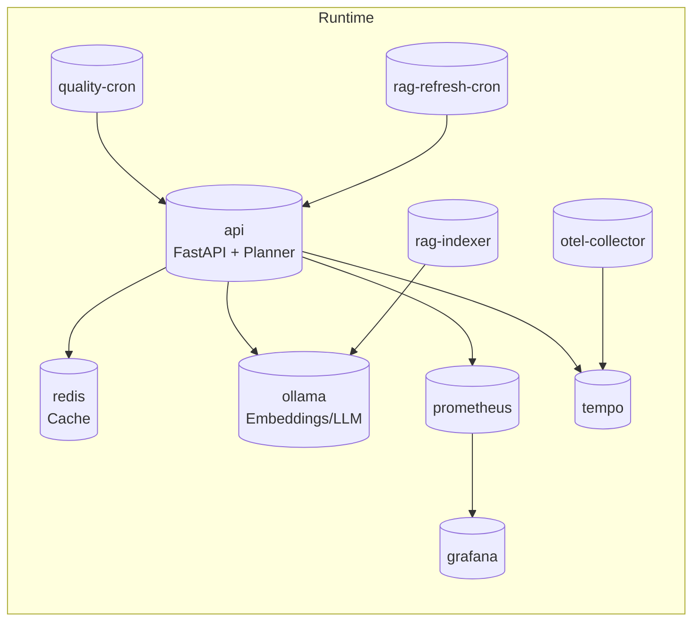

# C4 – Contêineres

> **Como validar**
> - Confirme a stack containerizada em `docker-compose.yml`, observando imagens, portas e dependências.【F:docker-compose.yml†L1-L197】
> - Revise `docker/Dockerfile.*` para verificar tecnologias e comandos de cada serviço buildado localmente.【F:docker/Dockerfile.api†L4-L54】【F:docker/Dockerfile.rag-indexer†L1-L120】
> - Garanta que cada contêiner corresponda às responsabilidades descritas verificando os módulos citados na API e crons.【F:app/api/__init__.py†L24-L43】【F:scripts/quality/quality_push_cron.py†L21-L226】

## Visão geral

## Contêineres e responsabilidades

| Contêiner | Propósito | Tecnologia / Build | Portas | Protocolos / Interfaces | Persistência | Fonte |
| --- | --- | --- | --- | --- | --- | --- |
| `api` | Servir FastAPI `/ask`, rotas de ops, métricas e tracing; bootstrap do planner, cache e executor | Build próprio `docker/Dockerfile.api` (Python 3.12, uvicorn) | 8000/tcp | HTTP/JSON, OTLP exporter | Volume bind `./:/app` (código) | 【F:docker-compose.yml†L2-L37】【F:docker/Dockerfile.api†L4-L54】【F:app/api/__init__.py†L24-L43】 |
| `redis` | Backend de cache read-through e políticas métricas | Imagem oficial `redis:7` | 6379/tcp | RESP, usado por `RedisCache` | Sem volume dedicado (volátil) | 【F:docker-compose.yml†L39-L45】【F:app/cache/rt_cache.py†L44-L216】 |
| `ollama` | Servir embeddings e geração LLM para Planner/Narrator | `ollama/ollama:0.3.14` | 11434/tcp | HTTP `/api/embeddings` e `/api/generate` | Volume nomeado `ollama:/root/.ollama` | 【F:docker-compose.yml†L47-L60】【F:app/rag/ollama_client.py†L18-L106】 |
| `ollama-init` | Pré-carregar modelos Ollama necessários | Build `docker/Dockerfile.ollama-init` | — | HTTP contra `ollama` | Stateless | 【F:docker-compose.yml†L62-L74】 |
| `rag-indexer` | Gerar/atualizar índice de embeddings JSONL | Build `docker/Dockerfile.rag-indexer` (Python) | — | Acesso a FS e Ollama HTTP | Usa bind `./:/app` para dados | 【F:docker-compose.yml†L76-L90】【F:scripts/embeddings/embeddings_build.py†L1-L160】 |
| `prometheus` | Coletar métricas da API e jobs | `prom/prometheus:latest` | 9090/tcp | HTTP scrape / UI | Volume `prometheus-data` | 【F:docker-compose.yml†L92-L104】【F:app/observability/runtime.py†L69-L96】 |
| `grafana` | Dashboards de observabilidade | `grafana/grafana:11.2.0` | 3000/tcp | HTTP UI | Volume `grafana` + dashboards montados | 【F:docker-compose.yml†L105-L122】 |
| `tempo` | Backend de tracing distribuído | Build `docker/Dockerfile.tempo` | 3200/tcp | HTTP Tempo API | Volume `tempo-data` | 【F:docker-compose.yml†L123-L136】【F:app/observability/runtime.py†L24-L64】 |
| `otel-collector` | Coletar spans OTLP e enviar ao Tempo | Build `docker/Dockerfile.otel-collector` | — | OTLP gRPC (`:4317`) | Stateless | 【F:docker-compose.yml†L137-L147】 |
| `quality-cron` | Disparar quality gate e relatórios usando rotas `/ops/quality` | Build `docker/Dockerfile.quality-cron`, scripts Python | — | HTTP para API (compartilha rede) | Read-only bind do repo | 【F:docker-compose.yml†L149-L170】【F:scripts/quality/quality_push_cron.py†L21-L226】 |
| `rag-refresh-cron` | Automatizar refresh do índice RAG via API | Build `docker/Dockerfile.rag-refresh-cron` | — | HTTP para API | Stateless | 【F:docker-compose.yml†L172-L185】 |

## Notas adicionais

- Não há serviço Postgres no compose; a aplicação espera um `DATABASE_URL` externo conforme `.env.example`, exigindo provisionamento manual do banco com as views SQL referenciadas pelas entidades YAML.【F:.env.example†L1-L43】【F:data/entities/fiis_precos/entity.yaml†L1-L115】
- Os contêineres `quality-cron` e `rag-refresh-cron` usam `network_mode: "service:api"`, permitindo chamar `localhost:8000` dentro do namespace da API, o que simplifica dependências mas exige que a API esteja saudável para iniciar.【F:docker-compose.yml†L149-L185】

<!-- ✅ confirmado: todos os serviços do compose aparecem no diagrama. -->
<!-- ✅ confirmado: propósitos/tecnologias corretos (FastAPI, Redis 7, Prometheus, Grafana 11.2, Tempo, OTEL, Ollama). -->
<!-- ✅ confirmado: relações (api ↔ redis/pg/ollama; api → otel-collector → tempo/prometheus; grafana ← prometheus/tempo). -->
