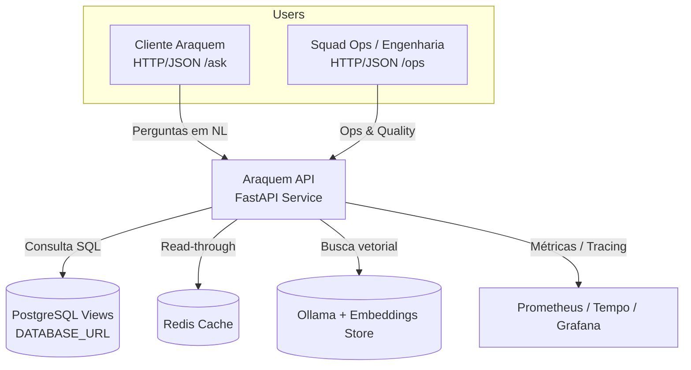

# C4 – Contexto

> **Como validar**
> - Inspecione as rotas públicas em `app/api/ask.py`, `app/api/health.py` e `app/api/ops/*.py` para confirmar os atores descritos.【F:app/api/ask.py†L56-L330】【F:app/api/health.py†L11-L40】【F:app/api/ops/cache.py†L19-L39】
> - Verifique o consumo de serviços externos (Postgres, Redis, Ollama, Prometheus) nas camadas core e de infraestrutura.【F:app/core/context.py†L13-L17】【F:app/executor/pg.py†L25-L69】【F:app/rag/ollama_client.py†L18-L75】【F:docker-compose.yml†L39-L136】

## Visão de contexto

A plataforma expõe uma API HTTP que atende clientes de produto (/ask) e usuários operacionais (/ops/*), orquestrando consultas analíticas sobre FIIs via banco relacional, cache Redis e índice RAG. A observabilidade integra Prometheus/Grafana/Tempo, enquanto operadores internos usam endpoints autenticados para bust de cache, auditoria de qualidade e manutenção do índice vetorial.【F:app/api/ask.py†L56-L330】【F:app/api/ops/quality.py†L29-L200】【F:app/api/ops/metrics.py†L15-L38】【F:docker-compose.yml†L2-L186】

**Relacionamentos principais**

- Clientes enviam payloads JSON com perguntas e metadados para `/ask`, recebendo dados tabulares e respostas textuais geradas pelo Narrator quando habilitado.【F:app/api/ask.py†L49-L330】
- Operações utilizam `/ops/cache/bust`, `/ops/quality/push` e `/ops/metrics/*` para gerenciar cache, avaliar roteamentos e registrar métricas de RAG.【F:app/api/ops/cache.py†L19-L39】【F:app/api/ops/quality.py†L29-L200】【F:app/api/ops/metrics.py†L15-L38】
- A API executa queries em Postgres via `PgExecutor` e aplica cache Redis conforme as políticas definidas em YAML, reduzindo latência de métricas agregadas.【F:app/orchestrator/routing.py†L286-L459】【F:app/cache/rt_cache.py†L15-L216】【F:data/policies/cache.yaml†L8-L71】
- Observabilidade centraliza métricas e traces em Prometheus/Tempo, expostos pelo serviço `/metrics` e pelo collector OTLP configurado no bootstrap.【F:app/api/health.py†L33-L40】【F:app/observability/runtime.py†L24-L64】【F:docker-compose.yml†L92-L148】
