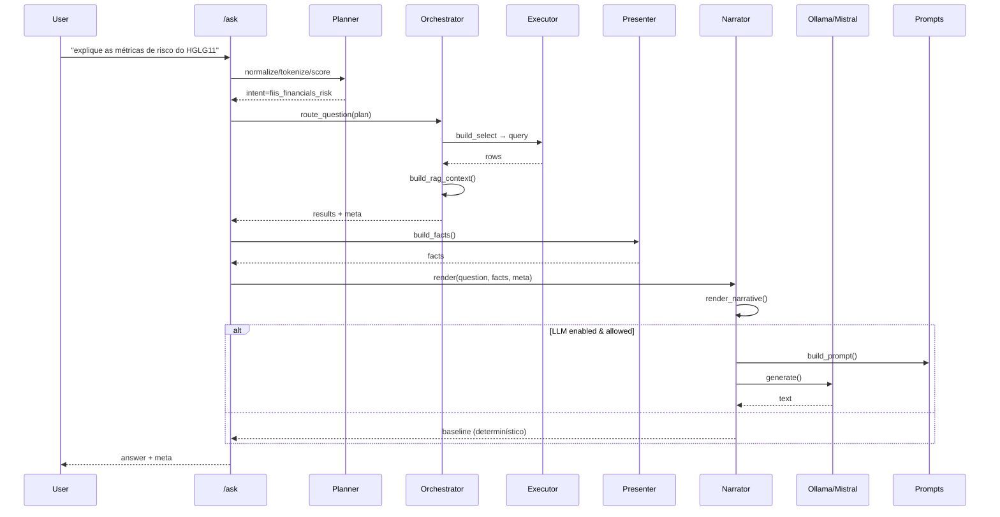

# **NARRATOR_FLOW_RISK_SINGLE_PATH.md**

### **(Fluxo completo — pergunta real → resposta final — entidade `fiis_financials_risk`)**

## **1. Escopo**

Este documento descreve, passo a passo, **o fluxo exato** que uma pergunta real percorre no Araquem **do início ao fim**, considerando o caso específico:

> **Pergunta:**
> `explique as métricas de risco do HGLG11`
> **Entidade:** `fiis_financials_risk`

O objetivo é mapear o caminho **completo**, usando **arquivos, funções e estruturas reais do repositório** — sem abstrações — para possibilitar auditoria, limpeza e refino do fluxo posteriormente.

---

# **2. Fluxo ponta a ponta — Em ordem cronológica real**

A seguir está o **pipeline real**, exatamente na ordem em que o código executa:

---

## **2.1. Entrada HTTP → `/ask`**

**Arquivo:**
`app/api/ask.py`
**Função:**
`async def ask(payload: AskPayload, ...)`

### Responsabilidade

1. Recebe o JSON da requisição com:
   * `question`
   * `conversation_id`
   * `nickname`
   * `client_id`

2. Passa a pergunta ao Planner:

   ```python
   plan = planner.explain(payload.question, explain=explain_flag)
```

3. Executa:

   ```python
   orchestrator.route_question(plan)
   ```

4. Constrói `facts` via Presenter (`build_facts`).

5. Chama o Narrator:

   ```python
   narrator_result = narrator.render(question, facts.dict(), meta_for_narrator)
   ```

6. Monta e devolve o JSON final.

---

## **2.2. Planner — Identificação de intent/entity**

**Arquivo:**
`app/planner/planner.py`

### Funções envolvidas

* `_normalize()`
* `_tokenize()`
* `_score_intents()`
* `_apply_thresholds()`
* `planner.explain(...)`

### Resultado para esta pergunta

* **Intent escolhido:** `fiis_financials_risk`
* **Entity:** `fiis_financials_risk`
* **Score:** ~1.037
* **Aceito:** true
* `meta['planner']` é preenchido com todos os detalhes, inclusive `intent_scores`, `decision_path`, `rag_fusion`, etc.

---

## **2.3 Orchestrator — Roteamento SQL + RAG Context**

**Arquivo:**
`app/orchestrator/routing.py`
**Função principal:**
`Orchestrator.route_question(plan)`

### Responsabilidades

1. Valida score/gap.

2. Resolve parâmetros inferidos.

3. Extrai ticker(s):

   ```python
   extract_identifiers(...)
   ```

4. Monta SQL:

   ```python
   build_select_for_entity('fiis_financials_risk')
   ```

5. Executa consulta:

   ```python
   PgExecutor.query(sql)
   ```

6. Aplica `format_rows`.

7. Define:

   * `results[result_key]`
   * `meta.rows_total`
   * `meta.entity`
   * `meta.intent`
   * `meta.requested_metrics` (empty aqui)

8. Constrói contexto de RAG:

   ```python
   rag_ctx = build_rag_context(...)
   meta['rag'] = rag_ctx
   ```

### Resultado SQL

`results['financials_risk'] = [ { ... métricas do HGLG11 ... } ]`

---

## **2.4. Presenter — Construção de FACTS**

**Arquivo:**
`app/presenter/presenter.py`
**Função:**
`build_facts(plan, orchestrator_results, identifiers, aggregates)`

### FACTS real gerado

```json
{
  "result_key": "financials_risk",
  "primary": {
    "ticker": "HGLG11",
    "volatility_ratio": "1,44%",
    "sharpe_ratio": "-1,07%",
    "treynor_ratio": "-0,13%",
    "jensen_alpha": "0.000",
    "beta_index": "0.403",
    "sortino_ratio": "-10,19%",
    "max_drawdown": "0.1132",
    "r_squared": "0.0781"
  },
  "rows": [ { ... igual ao primary ... } ],
  "requested_metrics": [],
  "ticker": "HGLG11"
}
```

---

## **2.5. Narrator — Decisão determinístico vs LLM**

**Arquivo:**
`app/narrator/narrator.py`
**Função principal:**
`render(question, facts, meta)`

### Decisão interna

1. Executa renderer determinístico:

   ```python
   render_narrative(meta, facts, policy)
   ```

   → dispara:

   ```python
   _render_fiis_financials_risk(...)
   ```

2. Avalia se deve usar LLM:

   ```python
   self._should_use_llm(facts)
   ```

   Condições:

   * `llm_enabled == true`
   * `max_llm_rows > 0`
   * `len(facts.rows) <= max_llm_rows`

3. Caso LLM seja permitido:

   * Prepara baseline.
   * Chama `build_prompt(...)`
   * Envia para:

     ```python
     self.client.generate(prompt, model=self.model)
     ```

4. Resultado final é um dict:

   ```json
   {
     "text": "... resposta final ...",
     "latency_ms": ...,
     "tokens": {...},
     "used": true|false
   }
   ```

---

## **2.6. RAG dentro do Narrator — Como é usado**

**Arquivo:**
`app/narrator/prompts.py`
Funções:

* `_prepare_rag_payload(rag)`
* `build_prompt(...)`

### Estrutura do prompt final

1. `SYSTEM_PROMPT`
2. `[ESTILO]`
3. `[INTENT]` / `[ENTITY]`
4. `[PERGUNTA]`
5. `[FACTS]` (JSON)
6. `[RAG_CONTEXT]` (≤ 5 snippets truncados)
7. Template (summary/list/table)
8. Few-shot

### Problema observado

Mesmo proibido de copiar RAG, o LLM reproduziu exatamente os snippets.

---

# **3. Fluxo resumido (linha do tempo)**



---

# **4. Pontos críticos observados no caso `fiis_financials_risk`**

* RAG é construído em **duas camadas** (orchestrator + presenter).
* RAG contém **texto conceitual rico**, altamente propenso a ser copiado pelo modelo.
* SYSTEM_PROMPT contém instruções contraditórias (proibir cópia vs oferecer material rico).
* `fiis_financials_risk` já possui renderer determinístico, mas o LLM o ignora.

---

# **4.1. Observação estrutural crítica — RAG duplicado**

Existe uma duplicação importante no fluxo atual:

## **1) RAG criado no Orchestrator**

Arquivo:

```
app/orchestrator/routing.py
```

Trecho:

```python
meta['rag'] = build_rag_context(...)
```

→ Este é o contexto RAG do “momento de roteamento”.

## **2) RAG recriado no Presenter**

Arquivo:

```
app/presenter/presenter.py
```

Trecho:

```python
rag_policy = load_rag_policy()
rag_context = build_context(question, intent, entity, rag_policy)
```

→ Este segundo contexto ignora completamente o primeiro.

---

## **Impacto**

* Dois contextos RAG independentes coexistem.
* Narrator usa **apenas** o reconstruído no Presenter.
* Planner/Orchestrator e Presenter/Narrator passam a operar com realidades diferentes.
* Causa inconsistência, respostas imprevisíveis e dificuldade enorme de debug.

---

# **5. Este documento serve para**

✔ Auditoria do fluxo real
✔ Identificação de redundâncias
✔ Base para futura refatoração
✔ Entendimento completo do caminho da pergunta
✔ Suporte ao desenho do novo SYSTEM_PROMPT e política do Narrator/RAG
