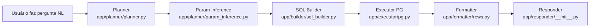

# Arquitetura NL→SQL

Este documento descreve o fluxo operacional vigente em 2025-11 (Guardrails v2.1.1), alinhando componentes de planejamento, execução e resposta.

## Pipeline detalhado

1. **Planner** (`app/planner/planner.py`) normaliza a pergunta, aplica ontologia e produz `intent`/`entity` candidatos com base em pesos declarados. Nesta etapa ocorre a fusão M7 com RAG opcional: quando `planner_thresholds.yaml` habilita RAG (`enabled: true`, peso `0.35`), sinais vindos do índice (`data/embeddings/store/embeddings.jsonl`) são combinados em modo *blend* enquanto o re-rank segue desativado (`re_rank.enabled: false`).【F:app/planner/planner.py†L1-L217】【F:data/ops/planner_thresholds.yaml†L1-L35】
2. **Inferência de parâmetros** (`app/planner/param_inference.py`) aplica regras declarativas para janelas, agregações e métricas conforme `data/ops/param_inference.yaml`, garantindo compute-on-read com base D-1 para intents `dividendos`, `precos` e `metricas` (padrões M8).【F:app/planner/param_inference.py†L1-L200】【F:data/ops/param_inference.yaml†L1-L73】
3. **SQL Builder** (`app/builder/sql_builder.py`) carrega o `entity.yaml` pertinente e compõe o `SELECT` parametrizado, respeitando whitelists de ordenação, substituições de janelas e templates de métricas.【F:app/builder/sql_builder.py†L1-L120】
4. **Executor** (`app/executor/pg.py`) executa a query na fonte PostgreSQL usando `psycopg`, com sanitização de parâmetros e telemetria de latência.【F:app/executor/pg.py†L1-L200】
5. **Formatter** (`app/formatter/rows.py`) converte linhas brutas em estruturas JSON alinhadas ao `presentation.kind` e prepara `rendered_response` para exposição no `/ask` com `render_rows_template`.【F:app/formatter/rows.py†L1-L200】
6. **Responder** (`app/responder/__init__.py`) monta a resposta textual final com base nos templates Jinja por entidade.【F:app/responder/__init__.py†L1-L160】

Todo o fluxo é orquestrado por `app/orchestrator/routing.py`, que aplica thresholds, integra cache de métricas e mantém telemetria (latências, gaps, top2).【F:app/orchestrator/routing.py†L1-L200】

## Marcos recentes

- **M7 – RAG blend opcional**: `planner_thresholds.yaml` ativa RAG com peso 0.35 e re-rank desligado; `app/planner/planner.py` calcula fusão linear e registra `rag_fusion_applied`.【F:data/ops/planner_thresholds.yaml†L26-L35】【F:app/planner/planner.py†L200-L310】
- **M8 – Compute-on-read D-1**: inferência temporal padrão define janelas (`months`/`count`) e métricas (`dividends_sum`, `price_avg`) sem alterar o payload imutável do `/ask`.【F:data/ops/param_inference.yaml†L9-L73】
- **M9/M10 – Novas entidades**: `fiis_financials_snapshot`, `fiis_financials_revenue_schedule`, `fiis_financials_risk`, `client_fiis_positions` e `fiis_metrics` ampliam o catálogo com colunas financeiras/posicionais, mantendo contratos YAML em `data/entities/*/entity.yaml`.【F:data/entities/fiis_financials_snapshot/entity.yaml†L1-L120】【F:data/entities/fiis_financials_revenue_schedule/entity.yaml†L1-L120】【F:data/entities/fiis_financials_risk/entity.yaml†L1-L120】【F:data/entities/client_fiis_positions/entity.yaml†L1-L120】【F:data/entities/fiis_metrics/entity.yaml†L1-L120】

## Integrações auxiliares

- **Cache**: `app/cache/rt_cache.py` aplica políticas declaradas em `data/policies/cache.yaml` para entidades públicas e privadas, com bloqueios condicionais para métricas (`deny_if`).【F:app/cache/rt_cache.py†L1-L200】【F:data/policies/cache.yaml†L1-L36】
- **Observabilidade**: métricas padronizadas vivem em `app/observability/metrics.py`, emitindo `sirios_planner_*`, `sirios_cache_*` e gauges RAG para Prometheus/Grafana.【F:app/observability/metrics.py†L1-L120】
- **Explicabilidade**: `/ask?explain=true` registra eventos em `explain_events` e injeta payloads produzidos por `app/analytics/explain.py`.【F:app/api/ask.py†L1-L220】【F:app/analytics/explain.py†L1-L160】

A arquitetura permanece declarativa: alterações operacionais devem ocorrer nos YAMLs de `data/ops`/`data/policies` ou nos contratos das entidades.
