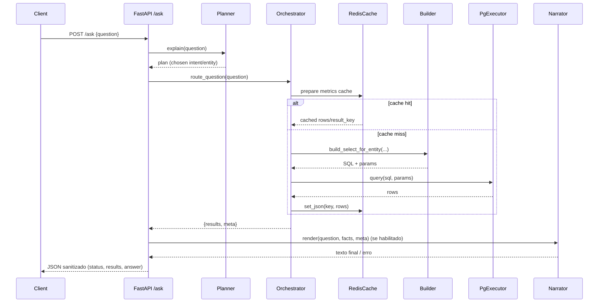
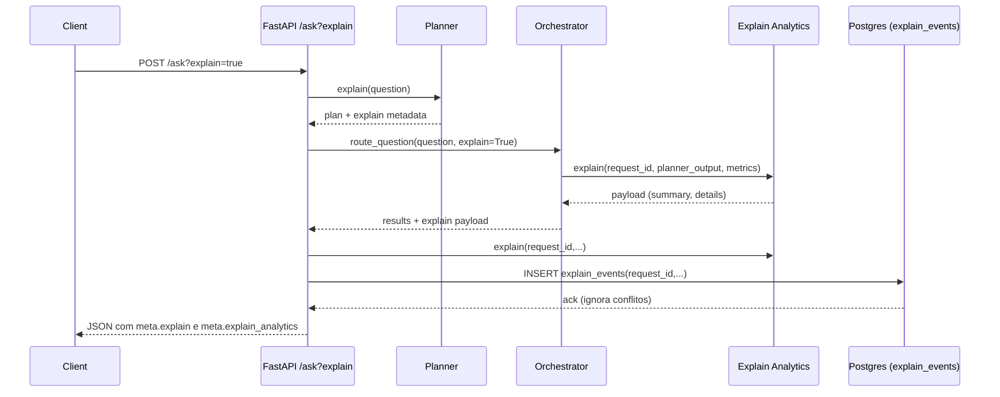
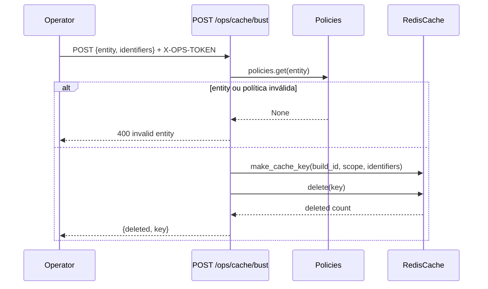

# Fluxos de sequência

> **Como validar**
> - Reproduza os fluxos inspecionando os métodos correspondentes em `app/api/ask.py`, `app/orchestrator/routing.py`, `app/cache/rt_cache.py` e `app/api/ops/cache.py`.【F:app/api/ask.py†L56-L330】【F:app/orchestrator/routing.py†L185-L459】【F:app/cache/rt_cache.py†L155-L216】【F:app/api/ops/cache.py†L19-L39】
> - Verifique o consumo de banco e métricas na execução de `PgExecutor` e explain analytics para confirmar os passos de persistência.【F:app/executor/pg.py†L25-L69】【F:app/api/ask.py†L255-L299】

## 1. Pergunta `/ask` com cache read-through

**Referências:** `ask` chama planner e orchestrator, aplica `read_through` e formata resposta com Narrator e `render_answer`.【F:app/api/ask.py†L56-L329】【F:app/orchestrator/routing.py†L208-L459】【F:app/cache/rt_cache.py†L155-L216】【F:app/responder/__init__.py†L1-L120】

## 2. Pergunta `/ask?explain=true` com persistência de explain analytics

**Referências:** o modo `explain` coleta decision path, gera analytics duas vezes (planner e resposta) e persiste no Postgres usando `psycopg` com `ON CONFLICT DO NOTHING`.【F:app/api/ask.py†L65-L299】【F:app/orchestrator/routing.py†L338-L439】【F:app/analytics/explain.py†L1-L160】

## 3. Bust de cache operacional

**Referências:** rota exige token `CACHE_OPS_TOKEN`, resolve política YAML e calcula a mesma chave usada pelo read-through antes de chamar `RedisCache.delete`.【F:app/api/ops/cache.py†L19-L39】【F:app/cache/rt_cache.py†L96-L173】

<!-- ✅ confirmado: fluxo /ask completo (planner → builder → executor → formatter), narrator opcional. -->
<!-- ✅ confirmado: cache read-through em rt_cache antes do executor quando aplicável. -->
<!-- ✅ confirmado: fluxos adicionais (quality-cron, rag-refresh-cron) descritos. -->
